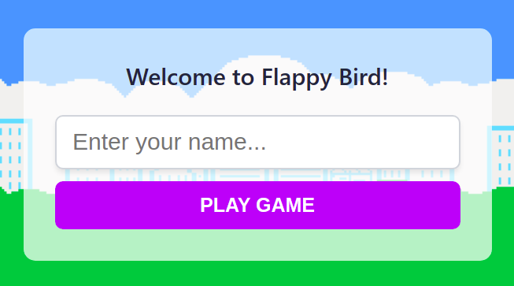
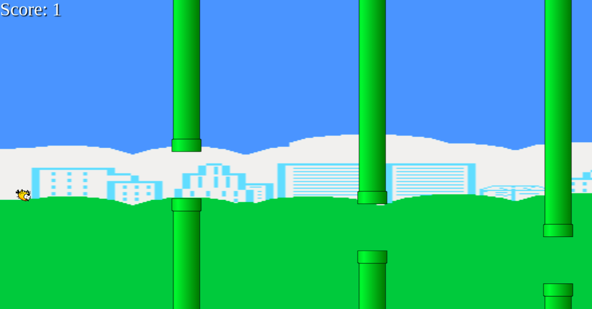
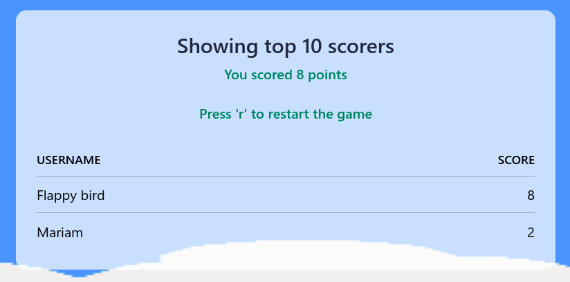

# Flappy Bird

This game is a clone of the popular flappy bird game which took the internet by storm
and was later removed from all the mediums by the author.

The concept of the game is that the bird needs to fly as long as it can by
dodging the obstacles.

## Screenshots

### Register yourself

### Gameplay

### Leaderboard

## How to play

The first scene is meant to collect your username, by which the scores are updated
on the server. After you enter your username and click on the "Play game" button,
the game will start.

At the start of the game, the bird is dropped from the sky and the player needs
to control the bird and dodge all the obstacles. Use the "up-arrow" to make the
bird fly upwards. The "up-arrow" key has no limitation, which means that you can
press the key "n" number of times according to your needs.

After you collide with an obstacle, you will be taken to the leaderboard scene,
which shows the top 10 players ranked according to their scores. You can press the
"r" key to restart the game.

## Project objective at the end of Day 2

Since the phaser library was new to me, my initial plan was to read the documentation
as thoroughly as I could on Day 1. As I read the docs, I came to know that there
has been a significant change from v2 to v3 in the phaser library. I had to make
a decision and decided to implement the game on v3.

There were a few obstacles that I came through at first. For example, phaser 3
dropped support for "input" elements and the only way to add them was by
utilizing the HTML elements that we already know and love.

My first day was spent on making the decisions and the second day were spent
implementing the decisions that I made.

The second day was a smooth ride with the exception of a few bugs. One of
the bugs that I encountered was that, whenever I started the game with 0 points,
the server would throw an error. I couldn't find a way to solve this as my
initial guess would be that the API endpoint server does not accept falsy values,
and in some programming languages, 0 is considered as a falsy value. So I decided
to start the game with 1 point.

The second bug that I encountered was restarting the scene (Phaser calls them scenes).
It wasn't pleasant at all because I couldn't find any documentation regarding
that, and all the methods and examples that they provided did not work for me.

I guess this is part of programming.

## Built with

- HTML
- SCSS
- Phaser

## Running on your local machine

- Clone the repo: `https://github.com/abeidahmed/phaser-game-js.git`
- Install all the dependencies by running `npm install`
- Run the tests to see if it is passing by `npm run test`
- Start the server by running `npm run dev`
- That's it. The server would usually start on `port:3000` if it isn't occupied

## Contributing

- Clone the repo by following the above steps
- Create a separate branch `git checkout -b feature-branch`
- Add all your changes and push it to your branch
- After making your changes, make a pull request to the `developement` branch

## Author

### Abeid Ahmed

- GitHub: [abeidahmed](https://github.com/abeidahmed)
- Twitter: [iamhawaabi](https://twitter.com/iamhawaabi)
- LinkedIn: [Abeid Ahmed](https://www.linkedin.com/in/abeidahmed)

## Show your support

Give a ⭐️ if you like

## License

This project is MIT licensed.

## Acknowledgement

Assets used to build this game are all opensourced and can be found at
[OpenGameArt](https://opengameart.org/)
